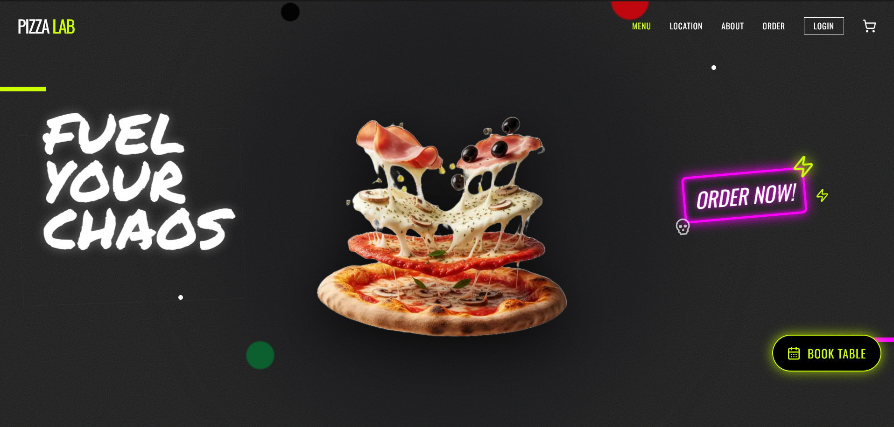

# 🍕 PIZZA LAB - Cyberpunk Pizzeria Experience

**Pizza Lab** is a cutting-edge, experimental pizzeria website built with **Next.js 16+ (App Router)** and **Tailwind CSS**. It features a high-fidelity cyberpunk/industrial aesthetic, immersive animations, and a fully functional e-commerce flow for browsing and customizing artisanal pizzas.


[Live Demo](https://pizzalab-theta.vercel.app/)


## 🚀 Tech Stack

- **Framework:** [Next.js 16](https://nextjs.org/) (App Router, React Server Components)
- **Language:** [TypeScript](https://www.typescriptlang.org/)
- **Styling:** [Tailwind CSS](https://tailwindcss.com/) with custom animations & responsive design.
- **Icons:** [Lucide React](https://lucide.dev/)
- **State Management:** React Context API (`CartContext`) + LocalStorage Persistence.

## ✨ Key Features

### 🖥️ Immersive UI/UX
- **Cyberpunk Aesthetic:** Dark mode by default, neon accents (Green/Pink), glitch text effects, and grainy textures.
- **Scroll Animations:** Reveal animations, and smooth scrolling navigation.
- **Responsive Design:** Fully optimized for mobile, tablet, and desktop views.
- **Custom System Pages:** Themed `404 Not Found` (Signal Lost) and `Loading` screens.

### 🍕 Functional Modules
- **Visual Menu:** Interactive grid with category filtering (All, Meat, Veggie, Spicy).
- **Pizza Detail Modal:**
  - Dynamic viewport sizing for mobile (`90dvh`).
  - "Origin Story" lore (hidden on mobile for cleaner UX).
  - Ingredient breakdown and beverage pairings.
- **Cart System:**
  - Sidebar drawer with animated entry.
  - Robust state persistence (survives page reloads via `localStorage`).
  - Real-time total calculation and quantity management.
- **Navigation:**
  - Active section detection (highlights current menu item on scroll).
  - Mobile-optimized menu and "Book Table" integration.
- **Interactive Footer:** Simulated newsletter subscription and social media links with neon hover effects.

## 🛠️ Installation & Setup

1.  **Clone the repository:**
    ```bash
    git clone https://github.com/your-username/pizzalab.git
    cd pizzalab
    ```

2.  **Install dependencies:**
    ```bash
    npm install
    # or
    yarn install
    # or
    pnpm install
    ```

3.  **Run the development server:**
    ```bash
    npm run dev
    ```

4.  **Open your browser:**
    Navigate to (http://localhost:3000) to view the application.

## 📂 Project Structure

```bash
src/
├── app/                  # Next.js App Router
│   ├── globals.css       # Global styles & Tailwind directives
│   ├── layout.tsx        # Root layout with fonts & providers
│   ├── page.tsx          # Main landing page
│   ├── not-found.tsx     # Custom 404 page
│   └── loading.tsx       # Custom Loading spinner
├── components/           # React Components
│   ├── Header.tsx        # Navbar with active state & mobile controls
│   ├── Hero.tsx          # Landing section with scroll-bound animations
│   ├── VisualMenu.tsx    # Main menu grid with filtering
│   ├── PizzaDetailModal.tsx # Detailed view for products
│   ├── CartSidebar.tsx   # Shopping cart drawer
│   ├── Footer.tsx        # Interactive footer
│   └── ... (Other UI components)
├── context/              # Global State
│   └── CartContext.tsx   # Cart logic & persistence
├── data/                 # Static Data
│   └── menu.ts           # Pizza product definitions
└── types/                # TypeScript Definitions
    └── pizza.ts          # Interfaces for Pizza, CartItem, etc.
```

## 🎨 Customization

### Tailwind Configuration
The project uses a custom Tailwind theme defined in `globals.css` (or `tailwind.config.js` depending on setup version) with variables for:
- **Colors:** `neon-green`, `neon-pink`, `dark-bg`.
- **Fonts:** `Oswald` (Headings), `Marker` (Accents), `Inter` (Body).

### Glitch Effects
Custom CSS utilities (`.glitch-text`, `.animate-glitch`) are available in `globals.css` and encapsulated in the `<GlitchTitle />` component for reusable chaotic text effects.


## 📄 License

This project is proprietary and intended for educational or portfolio purposes.
# Pizza Lab - Cyberpunk Pizzeria Experience
